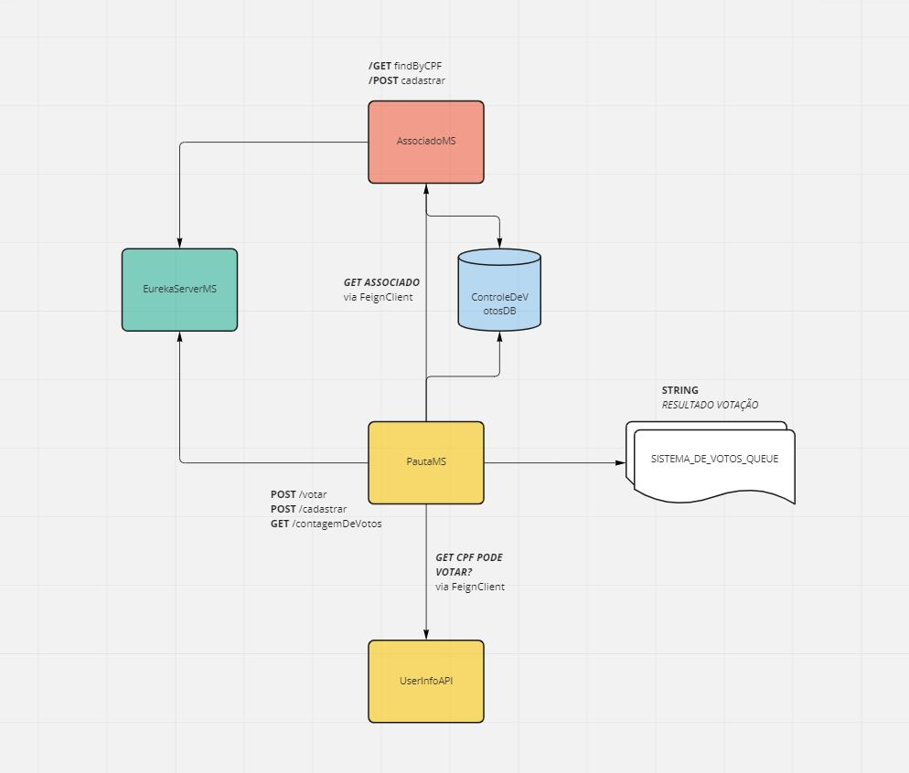
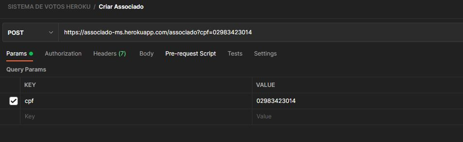
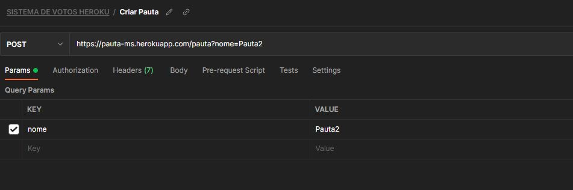
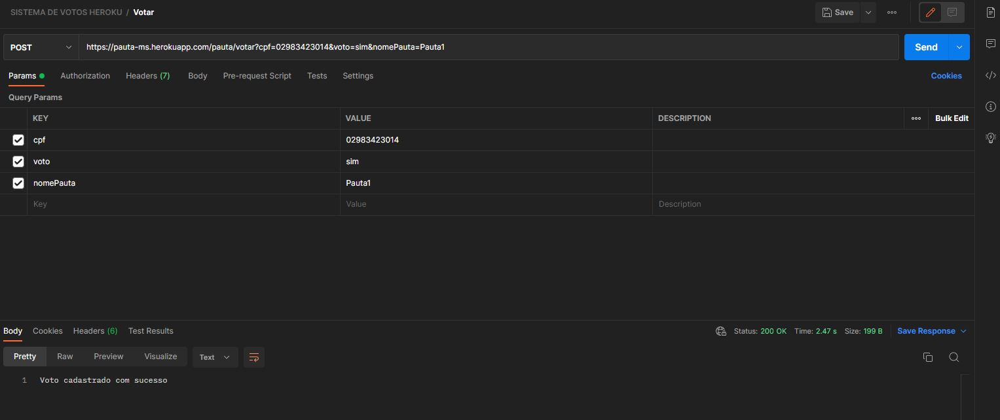
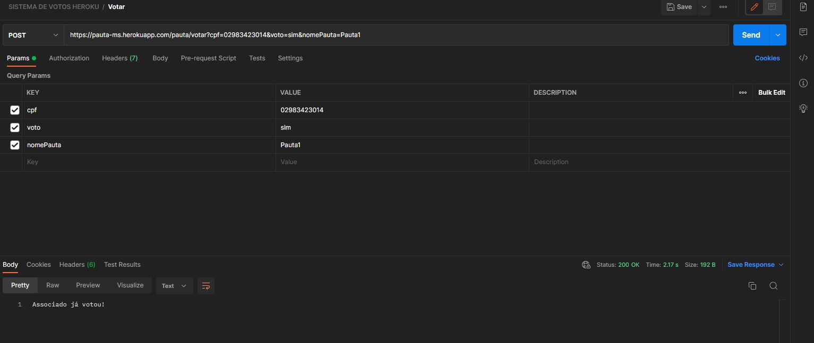
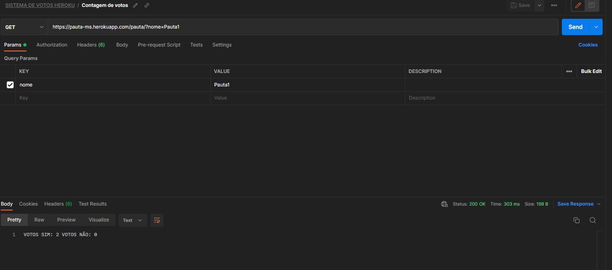
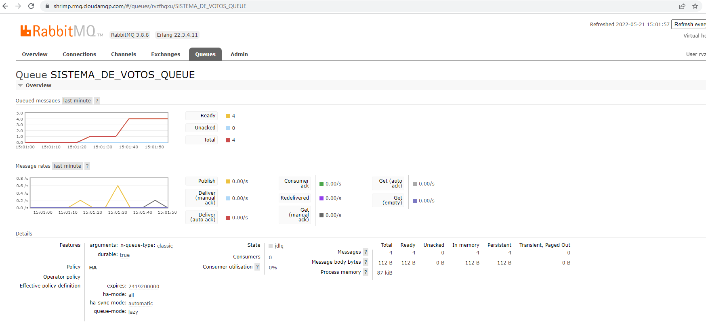
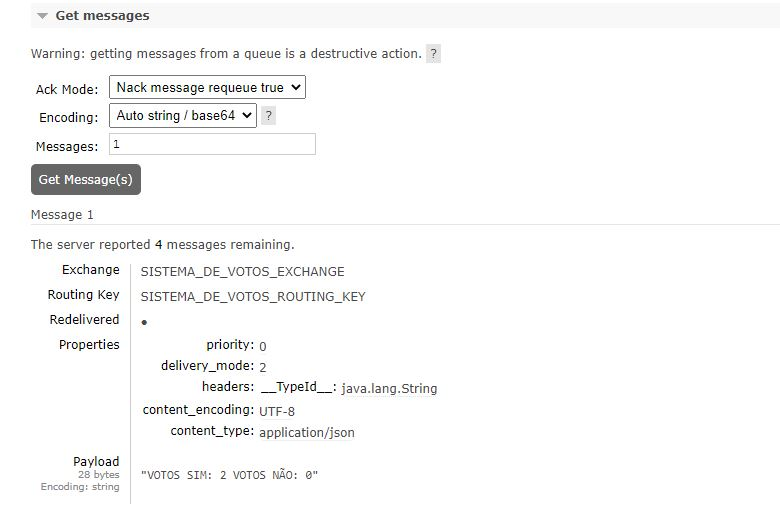
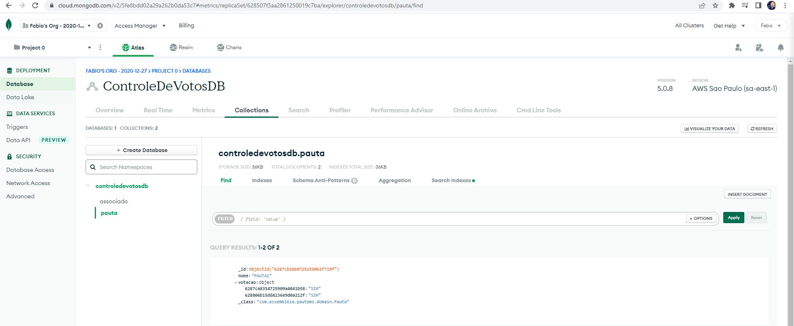

# Aplicação Sistema de Votos
**By Fabio Marsiaj**

Nesse projeto a intenção é criar uma simples aplicação de gerenciamento de votos dos associados.

O funcionamento básico se da desta forma:
Podemos criar uma Pauta e vários Associados; Uma Pauta tem um id, nome e um HashMap de String,Voto. Sendo string o id do associado.

Um _Associado_ tem:

    - Id;
    - Cpf;
    - Voto;

Uma _Pauta_ tem:

    - Id;
    - Nome;
    - HashMap<String, Voto> votos;

Depois que um associado VOTA o HashMap é atualizado com seu voto e seu id.

OBS: Na hora do voto a PAUTAMS consulta o CPF do associado no ASSOCIADOMS via FEIGN CLIENT. Visto que cada MS
tem sua responsabilidade.
Há também a consulta no UserInfo API no Herouk, para checar se o CPF pode votar.

Lembrando que um associado não pode votar duas vezes, e nem consegue.

Após todos associados votarem, podemos também ver a contagem dos votos, que nos dára o total de votos SIM e total de votos NAO.
Postando o resultado numa QUEUE no rabbitmq.

Segue o diagrama:

## Summary

- [Tecnologias](#tecnologias)
- [Consultando via Heroku](#consultando-via-heroku)
- [Autor](#autor)

## Tecnologias

Para este projeto decidi usar as tecnologias: SpringBoot, MongoDB, FeignClient, Netflix Stack OSS (Eureka discovery, ribbon) e 
rabbitqm para messageria.

O ribbon para podermos fazer um balanceamento de carga para o servido de pauta, caso há muita consulta dos votos.

Optei também por um design envolvendo microserviços pensando em escalabilidade e discovery dos mesmos.

O projeto se encontra no github e hospedado live no Heroku, MongoDB para o banco e para a fila no RabbitMQ.

## Consultando via Heroku

**ASSOCIADO-MS**: https://associado-ms.herokuapp.com/swagger-ui.html
**PAUTA-MS**: https://pauta-ms.herokuapp.com/swagger-ui.html
**EUREKA-SERVER-MS**: https://eureka-server-ms.herokuapp.com/

Abra o POSTMAN e siga como na imagem para criar um Associado:

Agora, crie uma Pauta:

Vamos, agora, fazer uma votação:

Tentemos votar novamente com o mesmo CPF...

OBS: Retorna 200 OK porém não registra um voto novo pra esse associado no banco.

Veremos um exemplo de contagem de votos:

Abrindo o rabbitmq em produção vemos o resultado postado na fila:

E só uma olhadinha no banco em produção:

## Autor

**Fabio Quinto Marsiaj** -  [GitHub](https://github.com/fabioqmarsiaj)

   
  